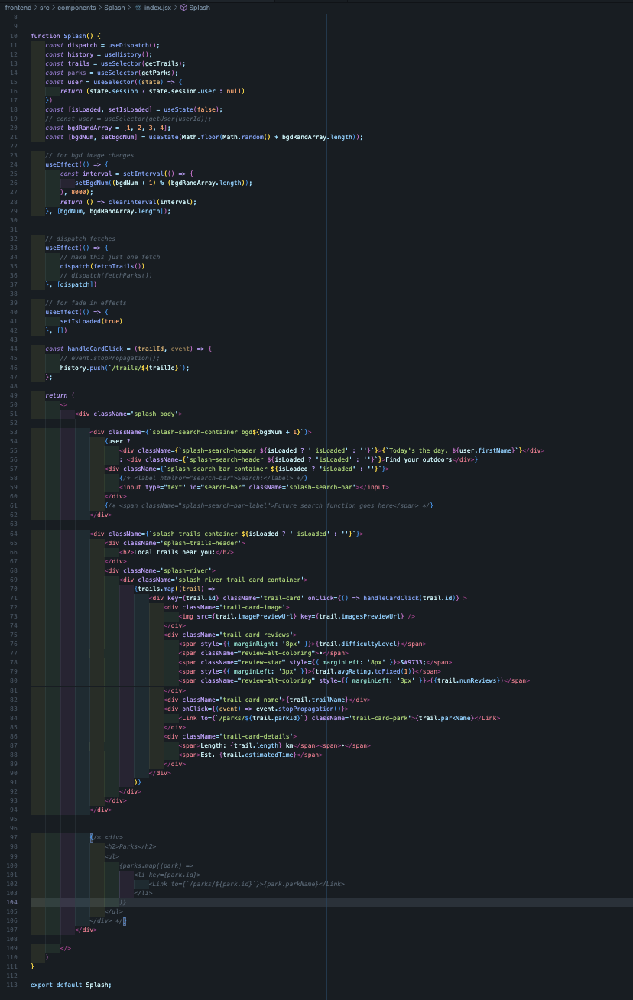
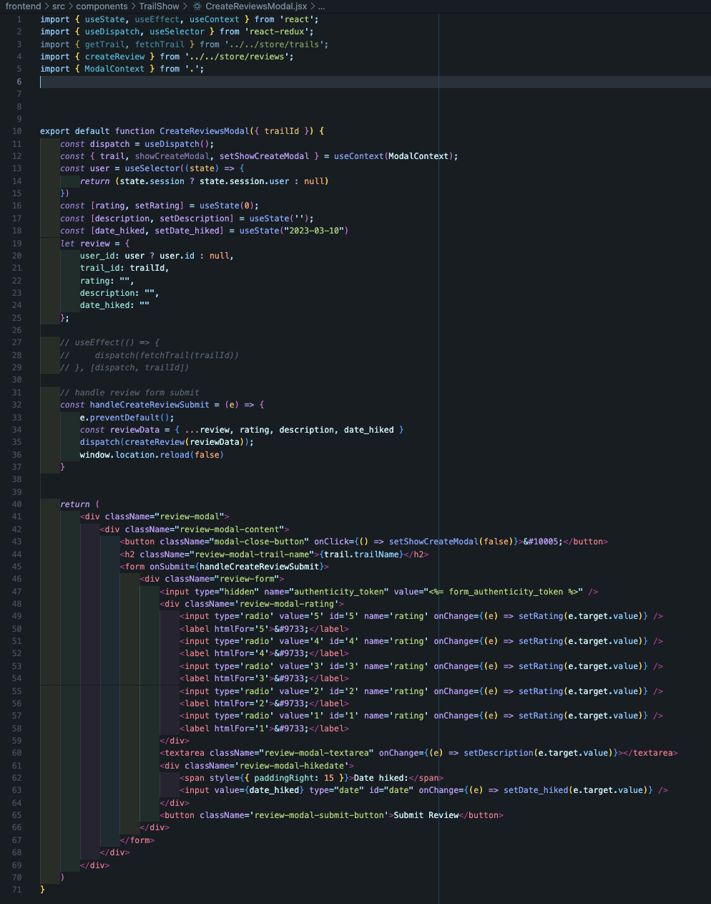

# Pathfinder

[Pathfinder live site!](https://pathfinder-ma4m.onrender.com/)

## Background 

Pathfinder is a fullstack clone (with a few stylish twists) of the outdoor activities site AllTrails, and geared towards exploring the beautiful, yet mostly unexplored nature of Indonesia!

The main content on Pathfinder comes in the form of various trails, which are suitable for hiking, running, cycling, and other outdoor activities. Users are able to view maps, photos, park info, and reviews for various trails, as well as write and edit reviews of their own.

## Technologies Used 

* React 
* Redux 
* Ruby on Rails 
* BCrypt 
* PostgreSQL 
* GoogleMap API

## Features 

### User Authentication - Login/Signup 

### Splash and Trail Pages

### Writing, Editing, and Deleting Reviews
 
 

### Search for Trails, Parks, or Tags

## Future Features 
* Saved - Users will be able to save trails
* Polyline - Trails will display a polyline of the entire trail route
